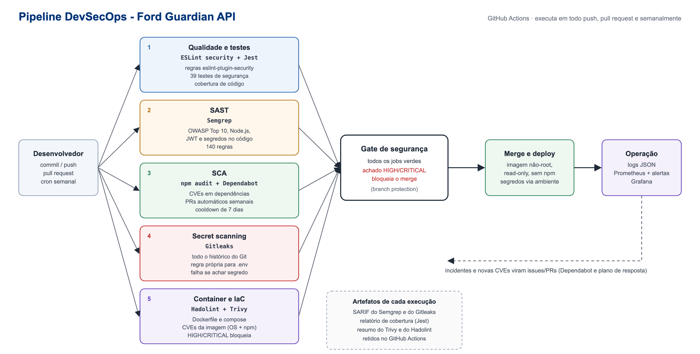

# 1. Pipeline DevSecOps integrado

**Objetivo:** a segurança faz parte do ciclo de desenvolvimento, do commit ao deploy. Cada push, pull request e uma
execução semanal agendada passam pelas mesmas verificações. Nada chega à `main` com achado HIGH ou CRITICAL.

Arquivo do pipeline: [`.github/workflows/devsecops.yml`](../.github/workflows/devsecops.yml) (GitHub Actions).
Atualização de dependências: [`.github/dependabot.yml`](../.github/dependabot.yml).

## 1.1 Etapas e riscos que cada uma reduz

| # | Etapa | Ferramenta | Quando roda | O que detecta | Risco reduzido | Gate |
|---|---|---|---|---|---|---|
| 1 | Qualidade e testes | ESLint + `eslint-plugin-security`, Jest | todo push/PR | padrões inseguros (eval, regex ReDoS, `child_process`), regressões nos controles (39 testes de segurança) | vulnerabilidade reintroduzida por engano | falha bloqueia |
| 2 | SAST | Semgrep (`p/owasp-top-ten`, `p/nodejs`, `p/javascript`, `p/jwt`, `p/secrets`) | todo push/PR | injeção, criptografia fraca, JWT mal validado, segredo no código, configuração insegura de CI | falhas de código antes do deploy (OWASP A03, A02, A07) | severidade ERROR bloqueia |
| 3 | SCA | `npm audit` + Dependabot (semanal, cooldown de 7 dias) | todo push/PR e segunda-feira | CVEs em dependências diretas e transitivas | cadeia de suprimentos (OWASP A06, API10) | HIGH/CRITICAL bloqueia |
| 4 | Secret scanning | Gitleaks (histórico completo + regra própria para `.env`) | todo push/PR | chaves, tokens e senhas commitados | vazamento de credenciais | qualquer achado bloqueia |
| 5 | Container e IaC | Hadolint, Trivy `config`, Trivy `image` | todo push/PR e semanal | Dockerfile/compose inseguros, CVEs do SO e dos pacotes da imagem | imagem vulnerável ou mal configurada em produção | HIGH/CRITICAL bloqueia |

Proteções do próprio pipeline:
- permissões mínimas (`permissions: contents: read`);
- actions fixadas por **hash de commit** (não por tag mutável), o que evita ataque de cadeia de suprimentos via action comprometida;
- Dependabot com **cooldown** de 7 dias, para não adotar uma versão maliciosa recém-publicada;
- relatórios SARIF e de cobertura guardados como artefatos de cada execução.

## 1.2 Resultado real das ferramentas neste projeto (antes → depois)

As ferramentas foram executadas sobre o código e encontraram problemas reais, que foram corrigidos nesta sprint.
Os relatórios completos estão em [`docs/evidencias/`](evidencias/).

| Ferramenta | Antes | Depois | O que foi corrigido |
|---|---|---|---|
| Semgrep (140 regras) | **14 achados** (1 ERROR, 3 MEDIUM, 10 WARNING) | **0** | AES-GCM sem tamanho de tag fixo (permitia aceitar tag truncada e forjar dados); 10 actions por tag mutável fixadas por SHA; cooldown no Dependabot |
| Gitleaks | 0 com regras padrão; **8 com a regra do projeto** | **0** | `.env` da Sprint 1 com 4 segredos reais no histórico: arquivo removido, `.gitignore`, segredos revogados (a API não os usa mais). 4 falsos positivos analisados e registrados em `.gitleaksignore` |
| Hadolint | **2 apontamentos** | **0** | `USER` numérico; `HEALTHCHECK` em notação JSON |
| Trivy image | **8 CVEs HIGH** | **0** | CVEs vinham do `npm` embutido na imagem base (`ip-address`, `pacote`, `sigstore`...). O runtime não precisa de `npm`: removido da imagem final |
| Trivy config | 0 | 0 | Dockerfile com usuário não-root, multi-stage e healthcheck |
| npm audit | 0 | 0 | dependências atualizadas; `crypto-js` substituído por `node:crypto` |
| ESLint security | **1 erro, 3 avisos** | **0** | regex de caracteres de controle justificada, leituras de arquivo com caminho de ambiente documentadas |

Lição registrada: as regras padrão do Gitleaks não detectaram os segredos do `.env` antigo porque tinham baixa entropia
(valores legíveis). A ferramenta foi calibrada com uma regra específica para as variáveis de segredo do projeto
([`.gitleaks.toml`](../.gitleaks.toml)).

## 1.3 Como o pipeline é executado no projeto Ford

1. **Branch protection na `main`:** merge só por pull request, com os 5 jobs obrigatórios verdes e revisão de outro integrante.
2. **Pull request:** o desenvolvedor abre o PR; os jobs rodam em paralelo (o de container depende dos testes). Um achado
   bloqueante mantém o PR vermelho até ser corrigido ou formalmente aceito (exceção registrada, com prazo).
3. **Execução semanal (segunda, 06h UTC):** reavalia dependências e imagem mesmo sem mudança de código, porque CVEs novas são publicadas todo dia.
4. **Dependabot:** abre PRs semanais de atualização, que passam pelo mesmo pipeline.
5. **Deploy:** a imagem aprovada roda como usuário não-root, com sistema de arquivos somente leitura, sem capabilities
   e com segredos injetados por variável de ambiente (`docker-compose.yml`).
6. **Operação:** logs, métricas e alertas (atividade 3) retroalimentam o backlog de segurança.

### Extensão para os demais componentes da solução

| Componente | Etapas equivalentes no pipeline |
|---|---|
| App mobile (React Native/Expo) | ESLint security + Semgrep (`p/react`, `p/typescript`), `npm audit`/Dependabot, Gitleaks (chaves de API no bundle), MobSF sobre o APK gerado no EAS Build |
| IoT (firmware/bridge MQTT) | Semgrep, Gitleaks (certificados e senhas de dispositivo), Trivy config nos arquivos do broker, validação de ACL |
| Dados e ML | Gitleaks e SCA nos notebooks/pipelines Python (`pip-audit`), verificação de que o dataset de treino é pseudonimizado, registro de versão do modelo |
