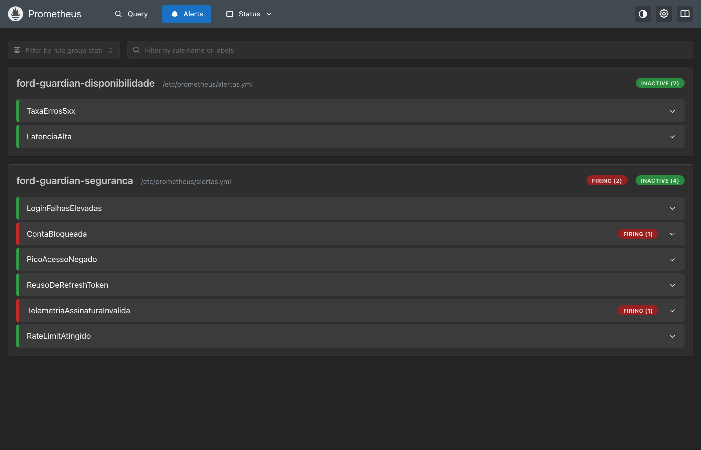
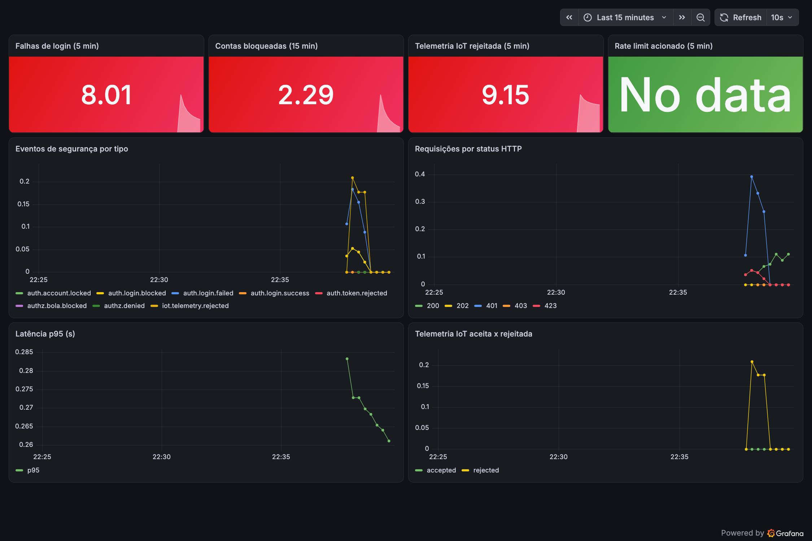

# 3. Observabilidade, monitoramento e resposta

**Objetivo:** o sistema detecta, registra e responde a incidentes. A API gera logs estruturados e métricas; o
Prometheus avalia regras de alerta; o Grafana mostra o painel de segurança. A resposta segue o plano da seção 3.5
([`03b-resposta-a-incidentes.md`](03b-resposta-a-incidentes.md)).

```
API (logs JSON + /metrics) --> Prometheus (coleta a cada 15s + regras de alerta) --> Grafana (dashboards)
        |                                        |
        +--> stdout do container (coletor de logs: Loki/ELK/Azure Monitor)   +--> alertas -> plantão (playbooks)
```

Como subir localmente: `./scripts/preparar-ambiente.sh && docker compose up -d --build`
(API em `:3000`, Prometheus em `:9090`, Grafana em `:3001`).

## 3.1 Logs estruturados

Todos os logs são JSON (winston), com `timestamp`, `level`, `event`, `requestId` (correlação, devolvido no header
`X-Request-ID`), `service` e `env`. Campos sensíveis (`password`, `token`, `authorization`, `phone`, `licensePlate`,
`cpf`...) são substituídos por `[REDACTED]` automaticamente, e e-mails aparecem mascarados (`fe***@example.com`).

| Evento | Nível | Quando |
|---|---|---|
| `auth.login.success` / `auth.login.failed` | info / warn | login (com número da tentativa) |
| `auth.account.locked` / `auth.login.blocked` | error / warn | 5 falhas: conta bloqueada |
| `auth.token.rejected` / `auth.refresh.rejected` | warn | token inválido, expirado, revogado ou refresh reutilizado |
| `authz.denied` / `authz.bola.blocked` | warn | perfil sem permissão / acesso a objeto de terceiro |
| `ratelimit.exceeded` | warn | limite de requisições atingido |
| `input.validation.failed` | info | dados rejeitados pela validação |
| `iot.telemetry.rejected` | warn | assinatura inválida, replay, timestamp antigo, dispositivo desconhecido |
| `audit.vehicle.created/updated/deleted`, `audit.user.registered` | info / warn | alterações críticas (trilha de auditoria) |
| `privacy.data.exported/deleted`, `privacy.consent.updated` | info / warn | direitos do titular (LGPD) |
| `incident.sessions.revoked` | error | contenção feita pelo administrador |
| `http.request` | info | toda requisição (rota, status, duração, usuário) |

Exemplos reais capturados durante a simulação de ataques ([`evidencias/logs-seguranca.jsonl`](evidencias/logs-seguranca.jsonl)):

```json
{"attempt":1,"email":"ma***@example.com","event":"auth.login.failed","ip":"::ffff:192.168.65.1","level":"warn","reason":"INVALID_CREDENTIALS","requestId":"d671797a-4a79-45b1-82e9-873dd18622e5","service":"ford-guardian-api"}
{"event":"authz.bola.blocked","level":"warn","path":"/api/vehicles/veh_003","requestId":"c73f4d2d-4499-4fba-94f2-d7fe41b73ca0","service":"ford-guardian-api","userId":"usr_003"}
{"deviceId":"obd-veh_004","event":"iot.telemetry.rejected","level":"warn","reason":"INVALID_SIGNATURE","requestId":"c67d7919-7f76-47ae-89af-7f4996ad7c86","service":"ford-guardian-api"}
```

Retenção: logs de segurança por 180 dias (`src/utils/dataRetention.js`), sem dados pessoais em claro.

## 3.2 Métricas

Endpoint `/metrics` (formato Prometheus), protegido por token próprio (`METRICS_TOKEN`).

| Métrica | Tipo | Uso |
|---|---|---|
| `http_requests_total{method,route,status}` | counter | taxa de requisições e de erros (RED) |
| `http_request_duration_seconds` | histogram | latência p95/p99 |
| `security_events_total{event}` | counter | todos os eventos de segurança da tabela acima |
| `iot_telemetry_total{result}` | counter | telemetria aceita, rejeitada ou sem consentimento |
| `ford_guardian_process_*`, `nodejs_*` | padrão | CPU, memória, event loop |

## 3.3 Alertas

Regras em [`infra/prometheus/alertas.yml`](../infra/prometheus/alertas.yml):

| Alerta | Condição | Severidade | Playbook |
|---|---|---|---|
| `LoginFalhasElevadas` | > 10 falhas de login em 5 min | high | força bruta |
| `ContaBloqueada` | qualquer bloqueio de conta em 5 min | medium | força bruta |
| `PicoAcessoNegado` | > 20 eventos 401/403 em 5 min | high | token roubado / varredura |
| `ReusoDeRefreshToken` | > 3 refresh rejeitados em 10 min | high | sequestro de sessão |
| `TelemetriaAssinaturaInvalida` | > 5 mensagens IoT rejeitadas em 5 min | high | dispositivo comprometido |
| `RateLimitAtingido` | > 50 bloqueios em 5 min | medium | abuso / scraping |
| `TaxaErros5xx` | > 5% de respostas 5xx por 5 min | critical | disponibilidade |
| `LatenciaAlta` | p95 > 1s por 5 min | medium | disponibilidade |

Alertas disparados durante a simulação (Prometheus):



## 3.4 Dashboard

Painel provisionado automaticamente no Grafana
([`infra/grafana/dashboards/ford-guardian-seguranca.json`](../infra/grafana/dashboards/ford-guardian-seguranca.json)),
capturado após a simulação de ataques (`scripts/gerar-trafego.js` e `iot/simulador-dispositivo.js`):



### Monitoramento dos demais componentes

| Componente | Métricas e alertas propostos |
|---|---|
| App mobile | sessões sem crash e erros por versão (Firebase Crashlytics/Sentry), falhas de login no app, versão mínima suportada |
| IoT | heartbeat por dispositivo (sem sinal há 30 min), mensagens rejeitadas por dispositivo, conexões TLS recusadas no broker |
| ML | distribuição das previsões por perfil (drift), latência de inferência, versão do modelo em produção |
| Infra | uso de CPU/memória do container, reinícios, validade dos certificados TLS |

## 3.5 Resposta a incidentes

O plano completo, com papéis, severidades, fluxo **Detecção → Análise → Contenção → Erradicação → Recuperação** e cinco
playbooks, está em [`03b-resposta-a-incidentes.md`](03b-resposta-a-incidentes.md). A API oferece ferramentas de
contenção: bloqueio automático de conta, revogação de todas as sessões de um usuário
(`POST /api/monitoring/users/{id}/revoke-sessions`, somente admin) e rejeição imediata de dispositivos não cadastrados.
