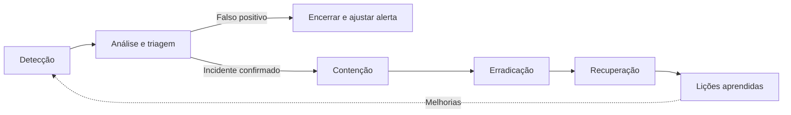

# 03b - Plano de Resposta a Incidentes

Projeto: **Ford Guardian** (Desafio 02 - VIN Share / pós-venda)
Contexto: Ford x FIAP 2026 - Sprint 3 de Cybersecurity (modelo DevSecOps)
Escopo: App mobile Ford Guardian, API `ford-guardian-api`, dispositivos IoT/OBD e broker MQTT, dados pessoais e modelo de ML, pipeline CI/CD.

Este plano define papéis, classificação de severidade, fluxo de resposta e playbooks para os cenários de maior risco identificados na modelagem STRIDE (ver `04-compliance-riscos.md`). A detecção se apoia nos logs estruturados JSON (winston, com `requestId`), nas métricas Prometheus expostas em `/metrics` e nas regras de alerta do Grafana/Prometheus.

---

## 1. Papéis e responsabilidades

| Papel | Responsabilidades |
|---|---|
| Incident Commander (IC) | Declara o incidente e a severidade, coordena a resposta, decide contenção e comunicação, conduz a reunião de lições aprendidas |
| Time técnico - API/Backend | Análise de logs e trilha de auditoria, rotação de segredos, correções e deploy |
| Time técnico - IoT | Análise do broker MQTT, revogação de credenciais e ACL de dispositivos, rotação de chaves HMAC, reprovisionamento |
| Time técnico - DevSecOps/SRE | Pipeline, dependências, imagens de container, métricas, alertas, backup e restauração |
| Analista de segurança | Triagem de alertas, correlação de eventos, preservação de evidências, análise de indicadores de comprometimento |
| Encarregado (DPO) | Avalia risco aos titulares, decide e conduz comunicação à ANPD e aos titulares (LGPD art. 48), mantém o registro do incidente |
| Comunicação | Mensagens a clientes, concessionárias e imprensa, sempre aprovadas pelo IC e pelo DPO |
| Jurídico | Apoio em obrigações legais, contratos com fornecedores e notificações |

Regra geral: uma única pessoa ocupa o papel de IC durante o incidente; toda decisão e ação relevante é registrada na linha do tempo do incidente, com horário em UTC.

---

## 2. Classificação de severidade

| Severidade | Critérios | Exemplos | Reconhecimento | Contenção inicial | Atualização de status |
|---|---|---|---|---|---|
| SEV1 - Crítico | Vazamento confirmado de dados pessoais; comprometimento de segredo criptográfico (JWT, HMAC, AES); indisponibilidade total do serviço; exploração ativa em produção | Segredo JWT vazado; dump de base com dados de clientes | 15 min | 1 h | A cada 30 min |
| SEV2 - Alto | Ataque ativo com impacto parcial; dispositivo IoT comprometido; CVE crítica explorável em produção; degradação severa | Telemetria forjada de um veículo; credential stuffing com contas acessadas | 30 min | 4 h | A cada 2 h |
| SEV3 - Médio | Ataque detectado e bloqueado pelos controles automáticos; vulnerabilidade HIGH sem evidência de exploração | Força bruta bloqueada pelo rate limit e bloqueio de conta; CVE HIGH em dependência | 4 h | 24 h | Diária |
| SEV4 - Baixo | Evento isolado sem impacto; falso positivo; vulnerabilidade MEDIUM/LOW | Pico pontual de 401; alerta de dependência sem exploração conhecida | 1 dia útil | Próximo sprint | No fechamento |

A severidade pode ser elevada a qualquer momento. Qualquer incidente com suspeita de acesso a dados pessoais aciona o DPO, independentemente da severidade.

---

## 3. Fluxo de resposta



| Fase | Objetivo | Ações principais | Saída |
|---|---|---|---|
| 1. Detecção | Identificar o evento o mais cedo possível | Alertas Prometheus/Grafana, eventos de log, achados do pipeline (Semgrep, Gitleaks, Trivy, Dependabot), relatos de clientes ou terceiros | Alerta registrado e responsável pela triagem definido |
| 2. Análise | Confirmar o incidente, medir escopo e impacto | Correlacionar logs por `requestId`, `userId`, `ip` e `deviceId`; consultar trilha de auditoria; definir severidade; preservar evidências (cópia dos logs com hash) | Incidente declarado com severidade, escopo e hipótese inicial |
| 3. Contenção | Interromper o dano sem destruir evidências | Bloquear IP/conta/dispositivo, revogar tokens e credenciais, desativar rota ou funcionalidade, isolar container | Ataque interrompido e sem propagação |
| 4. Erradicação | Remover a causa raiz | Corrigir código, atualizar dependência, rotacionar segredos, remover artefatos maliciosos, reforçar regra de detecção | Causa raiz eliminada e validada pelo pipeline |
| 5. Recuperação | Restabelecer a operação normal com segurança | Deploy da correção, restauração de backup quando necessário (RPO 24h / RTO 4h), monitoramento reforçado por 72 h | Serviço normalizado e monitorado |
| Lições aprendidas | Evitar recorrência | Reunião sem culpados em até 5 dias úteis; relatório pós-incidente; atualização de playbooks, alertas e modelo de ameaças | Relatório pós-incidente e ações com responsável e prazo |

---

## 4. Exemplos de logs estruturados usados na detecção

Os eventos abaixo são gerados pela API em JSON (uma linha por evento). Dados pessoais são mascarados e senhas ou tokens nunca são registrados.

```json
{"timestamp":"2026-09-27T21:04:12.381Z","level":"warn","service":"ford-guardian-api","event":"auth.login.failed","requestId":"8f1c2a7e-4b1d-4c55-9a0e-2f6d3b9e1a01","ip":"203.0.113.24","email":"fe***@example.com","reason":"INVALID_CREDENTIALS","attempt":4}
{"timestamp":"2026-09-27T21:04:19.902Z","level":"warn","service":"ford-guardian-api","event":"auth.account.locked","requestId":"1b7d9e30-6c2f-4e8a-b3d1-7a5f0c2e9b44","ip":"203.0.113.24","userId":"usr_004","email":"fe***@example.com","failedAttempts":5,"lockMinutes":15}
{"timestamp":"2026-09-27T21:04:25.117Z","level":"warn","service":"ford-guardian-api","event":"ratelimit.exceeded","requestId":"c4e8f1a2-9d3b-47c6-8e21-5b0a6d7f3c90","ip":"203.0.113.24","route":"POST /api/auth/login","limiter":"login","windowMinutes":15}
{"timestamp":"2026-09-27T21:12:03.554Z","level":"warn","service":"ford-guardian-api","event":"authz.bola.blocked","requestId":"5a2b7c9d-1e3f-4a6b-8c0d-9e2f4a6b8c1d","ip":"198.51.100.77","userId":"usr_003","role":"user","path":"/api/vehicles/veh_003"}
{"timestamp":"2026-09-27T21:18:47.206Z","level":"error","service":"ford-guardian-api","event":"iot.telemetry.rejected","requestId":"e9f0a1b2-3c4d-4e5f-9a8b-7c6d5e4f3a2b","deviceId":"obd-7f3a91","vin":"***********4X821","reason":"INVALID_SIGNATURE","clockSkewSeconds":2}
{"timestamp":"2026-09-27T21:25:31.640Z","level":"info","service":"ford-guardian-api","event":"audit.vehicle.deleted","requestId":"0d1e2f3a-4b5c-4d6e-8f9a-1b2c3d4e5f6a","ip":"198.51.100.12","userId":"usr_001","role":"admin","resourceId":"veh_003","result":"SUCCESS"}
```

| Evento | Uso na resposta |
|---|---|
| `auth.login.failed` | Base do alerta `LoginFalhasElevadas`; identifica IPs e contas-alvo (playbook 1) |
| `auth.account.locked` | Confirma a atuação do bloqueio automático; volume alto indica ataque distribuído (playbook 1) |
| `ratelimit.exceeded` | Indica automação/abuso por IP e rota (playbooks 1 e 2) |
| `authz.denied` | Tentativas de BOLA/BFLA; pico indica varredura de IDs ou uso de token roubado (playbooks 2 e 4) |
| `iot.telemetry.rejected` | Base do alerta `TelemetriaAssinaturaInvalida`; motivos `INVALID_SIGNATURE` e `STALE_TIMESTAMP` (playbook 3) |
| `audit.*` | Reconstrução da linha do tempo de ações críticas e responsabilização (todos os playbooks) |

---

## 5. Playbooks

### 5.1 Playbook 1 - Força bruta / credential stuffing no login

| Etapa | Ações |
|---|---|
| Gatilho | Alerta Prometheus `LoginFalhasElevadas` (mais de 10 falhas de login em 5 min); eventos `auth.login.failed` em sequência; aumento de `auth.account.locked` e de `ratelimit.exceeded` na rota `POST /api/auth/login`. Severidade inicial: SEV3 (SEV2 se houver login bem-sucedido suspeito) |
| Análise | Agrupar falhas por `ip` e por `email` mascarado: muitos e-mails a partir de poucos IPs indica credential stuffing; muitas tentativas contra uma conta indica força bruta dirigida. Verificar se houve `auth.login.success` para as contas-alvo a partir dos mesmos IPs. Verificar se contas `admin` ou `analyst` foram alvo. Conferir se o bloqueio automático (5 falhas) atuou |
| Contenção | Bloqueio automático de conta após 5 falhas e rate limit de login (5/15 min) já atuam. Bloquear IPs/faixas de origem no proxy reverso ou firewall. Para contas com login suspeito bem-sucedido: revogar refresh tokens do usuário, forçar novo login e redefinição de senha. Reduzir temporariamente o limite de tentativas se o ataque for distribuído |
| Erradicação | Resetar senhas das contas comprometidas; revisar a trilha de auditoria das contas acessadas para desfazer alterações indevidas; avaliar antecipação de MFA para perfis privilegiados; ajustar limiares de alerta se necessário |
| Recuperação | Desbloquear contas legítimas após confirmação com o titular; remover bloqueios temporários de IP após 24-72 h sem recorrência; monitorar `LoginFalhasElevadas` e bloqueios de conta por 72 h |
| Comunicação | Interna: IC e time técnico. Titulares cujas contas foram acessadas: aviso para troca de senha e orientação. Se houve acesso a dados pessoais de terceiros, acionar o DPO e seguir o playbook 4 |

### 5.2 Playbook 2 - Vazamento do segredo JWT / token roubado

| Etapa | Ações |
|---|---|
| Gatilho | Achado do Gitleaks contendo `JWT_SECRET`; segredo exposto em log, ticket ou canal público; tokens válidos associados a padrões anômalos (IP ou país incomum, uso simultâneo de um mesmo usuário em origens distintas); pico de `authz.denied` com tokens de assinatura válida. Severidade: SEV1 para segredo vazado; SEV2 para token individual roubado |
| Análise | Determinar se o vazamento é do **segredo** (permite forjar tokens de qualquer usuário e perfil) ou de **um token** específico (impacto limitado a um usuário). Levantar janela de exposição, usuários e rotas acessados, por `jti`, `userId` e `requestId`. Verificar na trilha de auditoria ações executadas com perfil `admin`/`analyst` no período |
| Contenção (segredo vazado) | Gerar novo `JWT_SECRET` forte (256 bits aleatórios) e atualizar o segredo no ambiente (GitHub Secrets / cofre); rotacionar também o segredo de refresh token, se separado; reiniciar a API: todos os access tokens emitidos com o segredo antigo passam a ser rejeitados. Revogar todos os refresh tokens armazenados, o que força novo login de todos os usuários |
| Contenção (token individual) | Revogar os refresh tokens do usuário afetado e forçar novo login; o access token roubado expira em até 15 min. Se o usuário for privilegiado e a janela de 15 min for inaceitável, rotacionar o segredo (impacta todos os usuários) |
| Erradicação | Remover a origem do vazamento (arquivo, log, variável exposta); se foi commit, confirmar que o segredo antigo está invalidado (a rotação resolve o risco, mesmo que o valor permaneça no histórico); revisar a redação de logs; corrigir o vetor de roubo de token (por exemplo, migração do AsyncStorage para `expo-secure-store` no app) |
| Recuperação | Validar login, refresh e logout com o novo segredo; desfazer ações indevidas identificadas na auditoria; monitorar picos de 401/403 e `authz.denied` por 72 h; registrar a rotação no controle de segredos |
| Comunicação | Interna: IC, DevSecOps, DPO. Usuários: aviso de que será necessário novo login (sem expor detalhes técnicos). Se houve acesso indevido a dados pessoais, seguir o playbook 4 |

### 5.3 Playbook 3 - Dispositivo IoT comprometido / telemetria forjada

| Etapa | Ações |
|---|---|
| Gatilho | Alerta Prometheus `TelemetriaAssinaturaInvalida`; eventos `iot.telemetry.rejected` com motivo `INVALID_SIGNATURE` ou `STALE_TIMESTAMP` (replay); valores fisicamente implausíveis aceitos (odômetro regredindo, saltos de posição); publicações negadas pela ACL no log do Mosquitto; conexões de um mesmo `deviceId` a partir de origens diferentes. Severidade inicial: SEV2 |
| Análise | Identificar `deviceId`, VIN e titular afetados; distinguir falha técnica (relógio dessincronizado, firmware desatualizado) de ataque (assinatura inválida persistente, replay, dispositivo clonado); verificar se a telemetria forjada gerou alertas preditivos ou agendamentos indevidos; verificar se outros dispositivos apresentam o mesmo padrão (chave comprometida em lote) |
| Contenção | Revogar a credencial MQTT do dispositivo: remover o usuário do arquivo de senhas (`mosquitto_passwd -D <arquivo> <deviceId>`) e a entrada correspondente na ACL; recarregar a configuração do broker (sinal SIGHUP) e, se a sessão ativa persistir, desconectar o cliente reiniciando o broker. Colocar o `deviceId` em quarentena na API (rejeitar `POST /api/telemetry`); marcar a telemetria do período como não confiável e suspender alertas preditivos daquele veículo |
| Erradicação | Rotacionar a chave HMAC do dispositivo (e a chave compartilhada, se o comprometimento for em lote); reprovisionar o dispositivo com nova credencial MQTT; atualizar o firmware se a causa for vulnerabilidade no OBD; inspeção física na concessionária em caso de dispositivo adulterado |
| Recuperação | Reativar o dispositivo com as novas credenciais; excluir ou recalcular alertas gerados por telemetria forjada; monitorar o `deviceId` por 7 dias; registrar a revogação e a nova chave no inventário de dispositivos |
| Comunicação | Titular do veículo: aviso sobre a suspensão temporária dos alertas e, se necessário, agendamento de inspeção. Concessionária responsável: orientação técnica. Se houve exposição de dados de telemetria ou localização, acionar o DPO (playbook 4) |

### 5.4 Playbook 4 - Vazamento de dados pessoais (LGPD)

| Etapa | Ações |
|---|---|
| Gatilho | Volume anômalo de leitura ou exportação na trilha de auditoria (`audit.*`, uso atípico de `GET /api/privacy/me/export`); pico de `authz.denied` seguido de acessos bem-sucedidos (exploração de BOLA); achado de segredo com acesso a dados; relato de cliente, pesquisador ou terceiro; dados da Ford Guardian encontrados em fonte pública. Severidade: SEV1 |
| Análise | Acionar imediatamente o DPO. Levantar: quais dados (cadastrais, veículo, localização, telemetria, histórico), quantidade de titulares, período, vetor e se o incidente está ativo. Verificar se os dados estavam cifrados (AES-256-GCM) e se a chave foi comprometida: dados cifrados com chave íntegra reduzem o risco. Avaliar risco relevante conforme a Resolução CD/ANPD nº 15/2024: o incidente pode afetar significativamente interesses e direitos dos titulares e envolve ao menos um critério como dados sensíveis, dados de crianças/adolescentes/idosos, dados financeiros, dados de autenticação, dados sob sigilo ou dados em larga escala |
| Contenção | Interromper o vetor (corrigir ou desativar a rota, revogar credenciais, bloquear origens); rotacionar segredos e chaves envolvidos (JWT, HMAC, AES com recriptografia dos dados); preservar evidências (logs e trilha de auditoria com hash) antes de qualquer limpeza; solicitar remoção do conteúdo publicado, quando aplicável |
| Erradicação | Corrigir a causa raiz (por exemplo, falha de autorização) com teste automatizado de regressão no pipeline; revisar acessos privilegiados; confirmar que não há persistência do atacante |
| Recuperação | Deploy da correção após gate verde; restauração de dados alterados a partir de backup, se necessário; monitoramento reforçado; oferecer aos titulares orientação e medidas de mitigação (troca de senha, atenção a phishing) |
| Comunicação | **ANPD**: se houver risco ou dano relevante, comunicar em até **3 dias úteis** a partir do conhecimento de que o incidente afetou dados pessoais, pelo formulário de comunicação de incidente da ANPD, informando natureza e categoria dos dados, número de titulares, medidas técnicas de proteção, riscos, medidas adotadas e, se for o caso, motivos da demora (LGPD art. 48, §1º). Informações complementares podem ser enviadas posteriormente. **Titulares**: comunicação em até 3 dias úteis, em linguagem clara, com descrição do ocorrido, dados afetados, riscos, medidas adotadas e recomendações, e contato do encarregado. **Registro**: todo incidente, comunicado ou não, é registrado e mantido por no mínimo 5 anos. Comunicação externa apenas com aprovação do IC, DPO e Jurídico |

### 5.5 Playbook 5 - Vulnerabilidade crítica em dependência (CVE)

| Etapa | Ações |
|---|---|
| Gatilho | Gate do pipeline bloqueado por `npm audit` ou Trivy com achado CRITICAL/HIGH; alerta ou PR do Dependabot; aviso de segurança (GitHub Security Advisory, NVD) de dependência usada pela API, pela imagem `node:22-alpine` ou pelo app. Severidade: SEV2 se CRITICAL e explorável em produção; SEV3 nos demais casos |
| Análise | Identificar pacote, versão, CVE, CVSS e se há exploração conhecida (por exemplo, catálogo CISA KEV). Verificar se a dependência é direta ou transitiva, se o código vulnerável é alcançável pela aplicação e se a versão afetada está em produção. Pesquisar nos logs indícios de exploração desde a publicação da CVE |
| Contenção | O gate impede que novos builds com a vulnerabilidade sejam promovidos. Se explorável em produção antes da correção: desativar a rota ou funcionalidade afetada, aplicar regra de bloqueio no proxy reverso e reforçar o monitoramento |
| Erradicação | Atualizar a dependência (merge do PR do Dependabot ou `npm update`/`overrides` no `package.json` para dependência transitiva); atualizar a imagem base e reconstruir o container; executar o pipeline completo (lint, Jest, Semgrep, `npm audit`, Gitleaks, Trivy, Hadolint). Se não houver correção disponível, avaliar substituição do pacote ou controle compensatório documentado com aceite de risco pelo IC |
| Recuperação | Deploy da versão corrigida; confirmar ausência do achado em novo scan Trivy da imagem publicada; fechar o alerta do Dependabot; monitorar por 72 h |
| Comunicação | Interna: time de desenvolvimento e IC. Se houver evidência de exploração com acesso a dados pessoais, elevar para SEV1 e seguir o playbook 4. Prazos de correção: CRITICAL 7 dias; HIGH 30 dias; MEDIUM 90 dias; LOW próximo ciclo |

---

## 6. Contatos e canais

| Canal | Uso | Contato |
|---|---|---|
| Plantão de segurança (on-call) | Acionamento de SEV1 e SEV2 a qualquer hora | Escala de plantão do time Ford Guardian (telefone do plantão definido na escala) |
| Sala de incidente | Coordenação em tempo real, uma sala por incidente (`inc-AAAAMMDD-nn`) | Canal dedicado no Microsoft Teams ou Slack |
| E-mail de segurança | Relatos internos e externos de vulnerabilidades e incidentes | `seguranca@fordguardian.example` |
| Encarregado (DPO) | Incidentes com dados pessoais e solicitações de titulares | `dpo@fordguardian.example` |
| ANPD | Comunicação de incidente de segurança com dados pessoais | Formulário de comunicação de incidente no portal gov.br/anpd |
| Fornecedores | Incidentes envolvendo terceiros (hospedagem, Firebase, provedores de integração) | Canais de suporte de segurança previstos em contrato |

Os endereços acima usam o domínio reservado `.example` e devem ser substituídos pelos canais oficiais antes da operação.

---

## 7. Template de relatório pós-incidente

```markdown
# Relatório pós-incidente - INC-AAAAMMDD-nn

## Identificação
- Título:
- Severidade (inicial / final):
- Incident Commander:
- Participantes:
- Data/hora de início, detecção, contenção e encerramento (UTC):

## Resumo
Descrição objetiva do que ocorreu, em até 5 linhas.

## Impacto
- Componentes afetados (App, API, IoT/Broker, Dados, ML, Pipeline):
- Usuários/titulares afetados (quantidade e perfis):
- Dados pessoais envolvidos (sim/não; categorias):
- Indisponibilidade (duração):

## Linha do tempo
| Horário (UTC) | Evento / ação | Responsável |
|---|---|---|

## Detecção
Alerta ou evento que identificou o incidente (ex.: LoginFalhasElevadas, iot.telemetry.rejected).
MTTD:

## Causa raiz
Análise dos 5 porquês.

## Resposta
Contenção, erradicação e recuperação executadas. MTTR:

## Comunicação
- ANPD (sim/não, data, protocolo):
- Titulares (sim/não, data, canal):
- Outros:

## Lições aprendidas
- O que funcionou:
- O que precisa melhorar:

## Ações corretivas
| Ação | Responsável | Prazo | Status |
|---|---|---|---|
```
